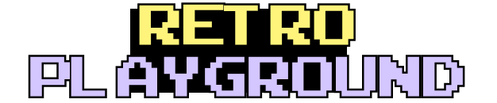

<div align="center">




### *Step back into the golden age of gaming*

[](YOUR_LIVE_URL_HERE)
[](LICENSE)
[](https://github.com/YOUR_USERNAME)

</div>

---

## 🌟 About

**Retro Playground** is a tribute to the golden age of gaming — a collection of classic, simple, and fun browser games wrapped in a nostalgic pixel-art arcade experience.

✨ **No ads.**  
✨ **No microtransactions.**  
✨ **Just pure retro fun.**

Experience the joy of classic arcade games, reimagined for the modern web with pixel-perfect aesthetics and instant playability.

---

## ✨ Features

- 🕹️ **Classic retro games** playable directly in the browser  
- 🎨 **Pixel-perfect UI** inspired by old arcade machines   
- 🧠 **Simple mechanics** — instant fun, zero learning curve  
- 💻 **Fully responsive** — works flawlessly on desktop & mobile

---

## 🕹️ Available Games

| Game | Description | Status |
|------|-------------|--------|
| 🐍 **Snake** | The timeless arcade classic where you grow longer with each meal | ✅ Live |
| ❌⭕ **Tic Tac Toe** | Simple, fast, and competitive — challenge a friend | ✅ Live |
| 🧠 **Memory Game** | Test and improve your focus with matching cards | ✅ Live |

> 🎮 **More games coming soon!** Stay tuned for Pong, Space Invaders, Breakout, and more...

---

## 🚀 Live Demo

<div align="center">

### 👉 **[Play Now](YOUR_LIVE_URL_HERE)** 👈

*Experience the nostalgia in your browser!*

</div>

---

## 📁 Project Structure

```text
Retro-Playground/
│
├── Games/
│   ├── Snake/
│   │   ├── snake.html
│   │   ├── snake.js
│   │   └── snake.css
│   ├── TicTacToe/
│   │   ├── tictactoe.html
│   │   ├── tictactoe.js
│   │   └── tictactoe.css
│   └── Memory/
│       ├── memory.html
│       ├── memory.js
│       └── memory.css
│
├── assets/
│   ├── images/          # Visual assets & sprites
│
├── style.css            # Global styles
├── index.js             # Main app logic
├── index.html           # Entry point
└── README.md
```

---

## 📝 License

This project is licensed under the **MIT License** - see the [LICENSE](LICENSE) file for details.

---

## 👨‍💻 Author

**OuassimDev**

---

## 🙏 Acknowledgments

- Inspired by classic arcade games from the 80s and 90s
- Pixel art assets made by Me (Figma)
- Retro fonts from GoogleFonts (Press+Start+2P)

---

<div align="center">

### ⭐ Star this repo if you enjoyed the games!

**Made with ❤️ and nostalgia**

*[Report Bug](https://github.com/YOUR_USERNAME/Retro-Playground/issues)* • *[Request Feature](https://github.com/YOUR_USERNAME/Retro-Playground/issues)*

</div>
